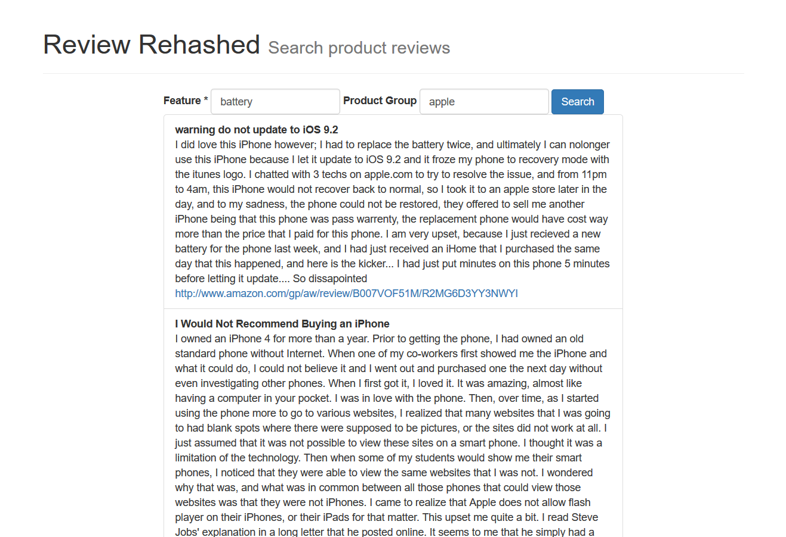

# Review-Rehashed
This project crawls amazon reviews and searches for a given feature from the reviews.

### Building the project
The project uses gradle as build tool.  For building the project

    gradlew crawlerjar
    gradlew shadowjar
    java -cp build/libs/amazon-crawler-1.0.jar com.reviewhashed.crawler.ReviewsController -l docs_dir -s asins.csv -n 1 -c crawl_dir
    java -cp build/libs/Review-Rehashed-1.0-all.jar com.reviewrehashed.indexer.Indexer -d crawl_dir -i index_dir

### Running the web server
This project uses jetty standalone server to run the web application.  This can be invoked from command line by using

    gradlew jettyRun.
    
By default, it runs on port 8080.  This can be confgiured in the build.gradle properties.
